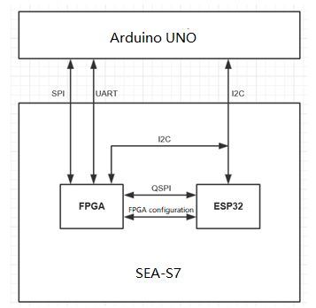

# SEA Board -Arduino FPGA Shield Software Interface Definition

 

| 版本 | 日期       | 描述                                                   |
| ---- | ---------- | ------------------------------------------------------ |
| 1.0  | 2019-04-16 | 初版                                                   |
| 1.1  | 2019-04-23 | 邸老师补充了I2C接口规范定义                            |
| 1.2  | 2019-09-23 | 1. 对I2C接口进行局部调整   2. 增加了具体引脚定义与描述 |

 

## 背景

SEA-S7板卡（Spartan Edge Accelerator Board）集成Spartan7 FPGA与ESP32芯片到单板，FPGA的并行性、高性能、低功耗和灵活配置特性，配合集成有WIFI与Bluetooth的ESP32芯片，可设计出满足多种场景需求的应用。

以下为SAE-S7板载 FPGA、板载ESP32和Arduino主控的主要通讯接口示意图，详细内容请参考板卡原理图。

SEA-S7 可单板使用，也可作为Arduino扩展子板，本文仅考虑作为Arduino扩展子板的应用场景。

## 目的

在作为Arduino扩展板的场景下， Arduino主控使用以下通讯接口访问SEA-S7。

. I2C 接口

. SPI 接口

本文将对以上接口进行了介绍，并提供了接口示例，为FPGA overlay与ESP32开发者提供参考。

## I2C接口规范

| 名称       | ESP32管脚   | 描述           |
| ---------- | ----------- | -------------- |
| ESP_SDA_A4 | ESP32_PIN12 | I2C   数据信号 |
| ESP_SCL_A5 | ESP32_PIN13 | I2C   时钟信号 |

 

当连接Arduino等主控板时，板载ESP32作为I2C从设备，为Arduino主控提供SEA-S7板卡状态查询与FPGA 比特流配置控制等功能。ESP32在启动时会加载1个默认FPGA比特流，同时在SD卡内可存储多个FPGA比特流，在板卡启动后可由Arduino选择FPGA配置文件，实时配置。

1. 设备地址

设备地址：0x52

写数据地址：0xA4，读数据地址0xA5

 

2. I2C接口示例

| **地址** | **状态** | **描述**                                                     |
| -------- | -------- | ------------------------------------------------------------ |
| 0x00     | RO       | 板载FPGA版本。   0: XC7S15   1: XC7S25                       |
| 0x01     | RO       | 配置X号Overlay (16bit编号)   **注：**ESP32   SD卡内的overlay目录用于存放FPGA 比特流。比特流文件名称应遵循**X_Y_Z.bit**的命名规则，其中X为比特流编号，Y为描述，Z为文件创建日期。如：01_ColorDetect_20190801.bit |
| 0x02     | RO       | 查询现有Overlay（比特流）数量（16bit数据）                   |
| 0x03     | RO       | X号Overlay的文件名（文件名通过指定报文传输）                 |
| 0x04     | RO       | 查询配置Overlay状态（0：配置完成，1：配置中）                |
| ……       | 备用     |                                                              |
| 0x0E     | W/R      | 配置文件名为xx的Overlay（文件名通过指定报文传输））          |
| 0x0F     | W/R      | 配置X号Overlay (16bit编号)                                   |
|          |          |                                                              |
| 0x2x     | 保留     | 用于AT指令配置WIFI                                           |

以读取Overlay文件名和按Overlay文件名配置Overlay为例：

读取文件名

| **地址** | **指令** | **数据16bit** |      | **地址** | **指令** | **长度8bit**  | **N 字节** |
| -------- | -------- | ------------- | ---- | -------- | -------- | ------------- | ------------- |
| OXA4     | 0x03     | 编号          |      | 0xA5     | 0x21     | 文件名字节数N | 文件名字符串  |

按文件名配置Overlay（用于用户自定义Overlay）

| **地址** | **指令** | **报头** | **长度8bit**  | **N 字节** |
| -------- | -------- | -------- | ------------- | ------------- |
| OXA5     | 0x0E     | 0x21     | 文件名字节数N | 文件名字符串  |

## SPI接口规范

| **名称**     | **FPGA 管脚** | **描述**                                                    |
| ------------ | ---------------- | ----------------------------------------------------------- |
| FPGA_AR_SCK  | H13              | SPI接口同步时钟，来自Arduino主控                            |
| FPGA_AR_MOSI | M5               | SPI接口主输出从输入                                         |
| FPGA_AR_MISO | L5               | SPI接口主输入从输出                                         |
| FPGA_AR_D10  | B2               | SPI片选信号                                                 |
| FPGA_AR_OE2  | M3               | 1：使能Arduino与FPGA SPI通讯   0：禁用Arduino与FPGA SPI通讯 |

 

FPGA作为Arduino主控的SPI从设备，Arduino主控可通过该接口对板载FPGA发送控制指令与获取数据。

1. SPI模式

Mode 0 : CPOL=0, CPHA=0

传输长度：8位

 

2. SPI通讯协议定义 – 指令

FPGA Overlay可接收的Arduino指令格式，指令以0xAA开始，1个字节的校验和结束：

| **帧头（1 Byte）** | **功能字（1 Byte）** | **参数长度（1 Byte）** | **参数(N Bytes)** | **检验和(1 Byte)** |
| ------------------ | -------------------- | ---------------------- | ----------------- | ------------------ |
| 0XAA               |                      |                        |                   |                    |

**备注:** 校验和表示帧头、功能字、参数长度、参数按字节累加后取低八位的数值。

 

3. SPI通讯协议定义 – 数据

FPGA Overlay发送给Arduino的数据格式定义如下，数据以0x55开始，1个字节的校验和结束：

| **帧头（1 Byte）** | **功能字（1 Byte）** | **数据长度（1 Byte）** | **数据(N Bytes)** | **检验和(1 Byte)** |
| ------------------ | -------------------- | ---------------------- | ----------------- | ------------------ |
| 0X55               |                      |                        |                   |                    |

**备注:** 校验和表示帧头、功能字、数据长度、数据按字节累加后取低八位的数值。

 

4. SPI通讯协议示例

以下协议为Arduino主控提供了对板载ADC与DAC的控制接口。

**指令格式：**

| 名称            | 帧头（1byte） | 功能字   （1byte） | 参数长度（1byte） | 参数N bytes）    | 校验和 | 描述                                                         |
| --------------- | ------------- | ------------------ | ----------------- | ---------------- | ------ | ------------------------------------------------------------ |
| 启动DAC         | 0xAA          | 0x01               | 0x00              | 无               | 0xAB   | 启动DAC输出                                                  |
| 停止DAC         | 0xAA          | 0x02               | 0x00              | 无               | 0xAC   | 停止DAC输出                                                  |
| 配置DAC数据     | 0xAA          | 0x03               | 0x02              |                  | -      | 配置DAC输出Byte1:bit3~bit0为高四位Byte2:bit7~bit0为低八位    |
| 启动/停止AD转换 | 0XAA          | 0x04               | 0x01              | Byte0 = 0或者1   | -      | 0：启动AD转换   1：停止AD转换                                |
| 设置采样率      | 0XAA          | 0x05               | 0x01              | Byte0：0x01~0x06 | -      | 0x01:   1MHz   0x02:   2MHz   0x03:   5MHz   0x04:   8MHz   0x05:   10MHz   0x06: 15MHz |
| 设置采样次数    | 0XAA          | 0x06               | 0x01              | Byte0：0x01~0x07 | -      | 0x01: 单次   0x02: 1k   0x03: 2k   0x04: 5k   0x05:   10k   0x06:   20k   0x07:   40k |
| 获取采样数据    | 0XAA          | 0x07               | 0x01              | 0x01~0x07        | -      | 设置获取的采样次数，参见“设置采样次数”的参数描述             |

 

**数据读取：**

| 名称        | 帧头（1byte） | 功能字   （1byte） | 参数长度（1byte） | 参数N bytes） | 校验和 | 描述                                     |
| ----------- | ------------- | ------------------ | ----------------- | ------------- | ------ | ---------------------------------------- |
| ADC数据获取 | 0x55          | 0x07               | 0x01- 0x07        | -             | -      | 实际数据长度参见“设置采样次数”的参数描述 |

 

 

 